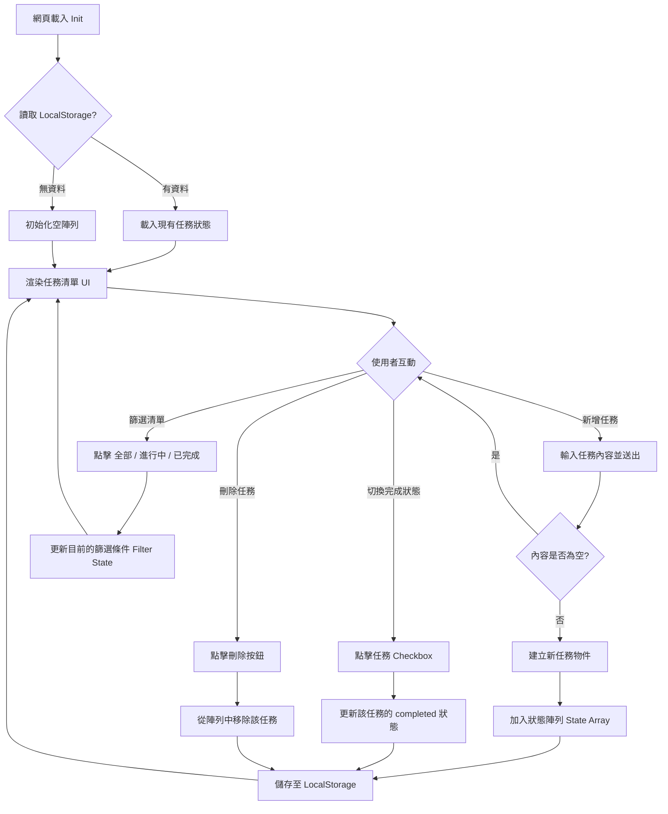

# 系統流程圖 (Flowchart)

以下流程圖說明了任務管理系統的核心運作邏輯，包含初始化、使用者互動以及資料儲存的流程。

## 流程說明
1. **初始化階段**：每次網頁載入時，系統會優先檢查 `localStorage` 是否有之前存下來的資料。如果有，就會直接帶入；沒有的話，就產生一個空的清單。接著，系統會根據這份資料把畫面 (UI) 畫出來。
2. **新增與狀態變更階段**：使用者每做一個動作（像是新增一筆待辦事項、打勾完成、或點擊刪除），系統都會即時更新記憶體中的資料陣列 (State Array)，然後馬上把這份最新的狀態同步存回 `localStorage` 中。最後，再次觸發畫面更新，讓使用者看到最新的結果。
3. **篩選階段**：當使用者切換下方的篩選頁籤（全部、進行中、已完成）時，並不會改變實際儲存的資料，而是更新「當前的檢視條件」，並讓畫面只顯示符合該條件的任務。
